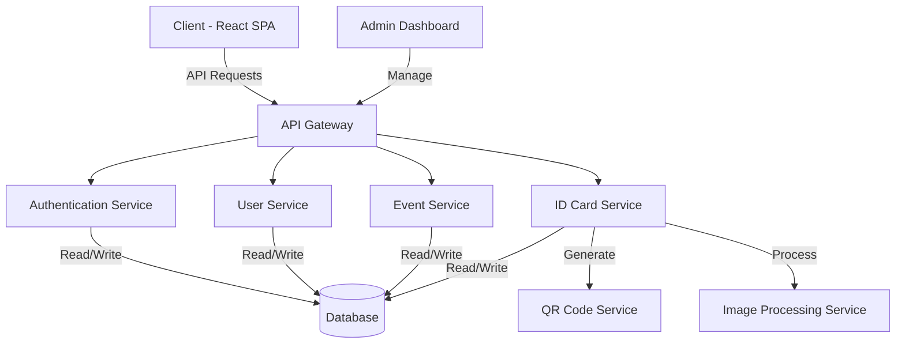

# ID-Craft  ->Event ID Card Creator

# Proposed Architecture

## Project Overview
Event ID Card Creator is a web application designed to simplify the process of creating and managing ID cards for events and organizations. This tool allows event organizers to quickly generate professional ID cards for attendees, enhancing event security and facilitating networking.

## Key Features
- Instant ID card generation
- QR code integration for easy contact sharing
- Customizable templates for different event types
- Secure user authentication and data management
- Scalable from small gatherings to large conferences

## Technology Stack
- Frontend: React, Redux, Material-UI
- Backend: Node.js, Express.js
- Database: PostgreSQL, MongoDB
- Containerization: Docker
- CI/CD: GitHub Actions
